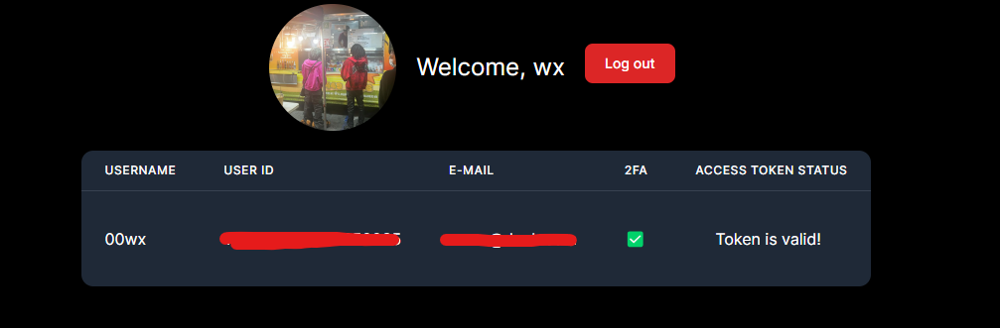

Really basic Discord OAuth2 project with persistent login, logout and more. No database needed, data is saved into local storage.

This project should NOT be used in production, treat it as a debug tool. You can tinker the data by editing the localstorage values.

# Setup

### Windows
```powershell
npm i
copy .env.local .env
# Edit your .env file, obtain your app client id at https://discord.com/developers/applications/
npm run dev
```

### Linux
```bash
npm i
cp .env.local .env
# Edit your .env file, obtain your app client id at https://discord.com/developers/applications/
npm run dev
```

# Used libraries

[Next.JS](https://nextjs.org/)

[Tailwind CSS](https://tailwindcss.com/)

[react-discord-login](https://github.com/angelxmoreno/react-discord-login)